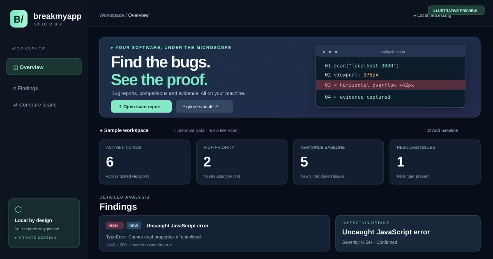

# BreakMyApp 🧪

**Your website looks perfect. Let's prove it wrong.**



*Illustrative Studio preview. Run `npm run studio` for the real interactive dashboard; sample data is not a live scan.*

BreakMyApp is an open-source, local-first website bug scanner. It uses a real Chromium browser to collect **evidence**, not guesses: responsive overflow, uncaught JavaScript errors, failed static resources, and screenshots you can inspect offline.

> **Status: developer preview (scanner v0.1.0, Studio v0.2 preview).** Not published to npm yet. The project is actively being built; the first release is intentionally limited in scope.

## What's working

- 📱 **Responsive overflow detection** at 375×812, 768×1024 and 1440×900, or custom viewport sizes.
- 🐛 **Browser runtime error tracking** for uncaught JavaScript errors, plus HTTP errors on the main page.
- 🖼️ **Failed resource detection** for images, scripts and stylesheets returning HTTP 4xx/5xx or experiencing network failures (labelled needs-review).
- ♿ **Opt-in accessibility auditing** using axe-core and per-element WCAG guidance.
- 🧩 **Local community rule plugins** to add custom checks without modifying the core.
- 🔎 **Opt-in same-origin crawling**, up to 25 pages, with conservative URL filtering and per-page evidence.
- 🖼️ **Visual Regression Testing** — approved baseline PNGs, changed-pixel percentages, and highlighted before/after/diff images.
- 🎬 **Opt-in Reproduction Packs** — runnable Playwright-powered Node.js tests plus browser Trace ZIPs.
- 📸 **Visual evidence**, captured for viewport(s) where findings occur.
- 📄 **Offline HTML and machine-readable JSON reports**, stored on your own machine.
- 🛠 **CI-friendly exit codes** with an opt-in --fail-on severity threshold.
- 🔒 **Local-first:** no account, AI API key, or hosted backend is required.

This release crawls only a bounded set of linked pages when explicitly requested; it does **not** replay arbitrary user journeys, verify button behavior or diagnose visual regressions. A clean report does not mean a bug-free application.

## 🖼️ Visual regression — compare what your users see

BreakMyApp can capture viewport screenshots as visual baselines and then identify meaningful pixel changes after a UI update. This feature runs locally and is disabled unless you enable it.

Try a deterministic demo with two browser-visible variants of the **same URL path**:

~~~bash
# Terminal 1
npm run demo:visual
~~~

~~~bash
# Terminal 2: save the reference screenshot
npm run scan -- "http://127.0.0.1:4175/?variant=before" --viewport 375x812 --visual-save .breakmyapp/baselines

# Compare a deliberately changed version of the same page:
npm run scan -- "http://127.0.0.1:4175/?variant=after" --viewport 375x812 --visual-compare .breakmyapp/baselines --visual-threshold 1
~~~

Open `.breakmyapp/index.html` to see the **baseline, current screenshot, and highlighted diff**. The JSON report includes a `visualComparisons` summary for every tested page and viewport. The default mismatch limit is **1% of pixels**; `--visual-threshold` accepts 0–100 as a percentage. A color tolerance reduces single-channel noise, but font rendering and dynamic content can still cause false positives.

Use the same commands with `--crawl` to compare multiple authorized pages. Baseline filenames are keyed by sanitized page URL and viewport; query strings are omitted from the filename but preserved for single-page navigation. Baselines and diff screenshots can contain private content—review before publishing. See [Visual Regression Guide](docs/visual-regression.md).

## 🧭 Studio — visualize and compare scans

**BreakMyApp Studio** is a standalone, local-first forensic dashboard. Import scan JSON files from your machine, visually explore findings, and compare today's report to a previous baseline.

**Run it locally** (Node.js 20+; no install, build, CI, API key, or Playwright required for Studio itself):

```bash
npm run studio
```

Open **http://127.0.0.1:4174**. Click **Explore sample report** for an illustrative comparison, or **Open scan report** to import a real `.breakmyapp/report.json`. Import an older scan using **Add baseline** to detect new, existing and resolved findings.

- Severity and change filters, search, viewport and diagnostic evidence inspector
- New / existing / resolved finding comparison (heuristic, review before acting)
- Export Markdown summaries and GitHub issue descriptions
- Browser-local JSON analysis with escaped DOM content and restrictive Content Security Policy
- Zero-dependency local test runner

Browsers cannot automatically load screenshots from arbitrary paths found in imported JSON files. For images, open the scanner-generated `.breakmyapp/index.html` report alongside Studio.

```bash
npm run test:studio
```

---

## Quick start

Requirements: Node.js 20+, npm and a system capable of launching Chromium.

~~~bash
git clone https://github.com/Mahmoud-Shabana/breakmyapp.git
cd breakmyapp
npm install
npx playwright install chromium
npm run build
~~~

Start our deliberately broken demo page in terminal one:

~~~bash
npm run demo
~~~

Then scan it in terminal two:

~~~bash
npm run scan -- http://127.0.0.1:4173
~~~

To generate and locally replay evidence for the authorized demo:

~~~bash
npm run scan -- http://127.0.0.1:4173 --viewport 375x812 --evidence
npm run test:repros
~~~

`--repro` generates runnable Playwright-based **Node.js test-runner** scripts; `--trace` records browser traces; `--evidence` enables both. Traces may contain sensitive page data and are not automatically redacted. See [Reproduction Packs](docs/reproduction.md).

Try the accessibility audit and an opt-in local plugin:

~~~bash
npm run scan -- http://127.0.0.1:4173 --a11y
npm run scan -- http://127.0.0.1:4173 --a11y --plugin ./examples/plugins/meta-description.mjs
~~~

Automated checks do not certify WCAG compliance. Plugins run as normal JavaScript with full Node.js permissions; use only trusted plugin files. See [docs/plugins.md](docs/plugins.md).

The demo deliberately causes layout overflow, a JavaScript exception, missing image and CSS resources, and a second page linked as /pricing. Open **.breakmyapp/index.html** in your browser. The JSON report lives in **.breakmyapp/report.json**.

To scan **multiple linked pages** of the local demo (default stays one page):

~~~bash
npm run scan -- http://127.0.0.1:4173 --crawl --viewport 375x812
npm run scan -- http://127.0.0.1:4173 --max-pages 10 --viewport 375x812
~~~

The crawler follows anchor links **only on the original origin**, breadth-first, up to 25 pages. It skips external domains, links with query strings, logout/deletion/payment-like paths, downloadable assets and fragments. It never clicks links or submits forms. Starting URL query strings are omitted in crawl mode. Browser JavaScript still executes normally when loading a page, so only test sites you own or have permission to scan. It is **not** a security crawler and does not enforce robots.txt.

To scan a local development server with a custom viewport:

~~~bash
npm run scan -- scan http://localhost:3000 --viewport 390x844 --output .breakmyapp/mobile
~~~

To make a scan fail with exit code 2 when it finds medium or high severity issues:

~~~bash
npm run scan -- http://localhost:3000 --fail-on medium
~~~

Use **npm test** for TypeScript build and unit tests. After installing Chromium, run **npm run test:browser** to execute the real-browser integration test on Windows, macOS or Linux. No GitHub Actions setup is required.

## What you'll get

- A local, readable HTML report with finding cards, severity labels and screenshots, plus opt-in links to repro tests and trace ZIPs.
- A structured JSON report with rule IDs, page URLs, tested pages, viewports, evidence and page-aware finding fingerprints.
- Meaningful exit codes: 0 for successful scan (unless --fail-on triggers); 1 for operational errors; 2 for requested severity threshold.

> **Privacy:** screenshots and exception messages may include private data. Report folders are ignored by Git. Do not upload them publicly without reviewing their contents. URLs with credentials are rejected, and query strings are removed from the saved target address.

## Architecture

- **packages/core** — Playwright runner, bounded link queue, axe-core adapter, local rule SDK, evidence capture and reports.
- **packages/cli** — argument parsing, summary output and exit codes.
- **examples/broken-site** — a reproducible, intentionally broken demonstration page.
- **examples/visual-regression** — two predictable visual variants for baseline/diff testing.

Learn more in [docs/architecture.md](docs/architecture.md) and [docs/crawling.md](docs/crawling.md).

## Roadmap

- [x] First real-browser scanner with evidence and offline reports.
- [x] Detect failed static resources with conservative classification and privacy-safe URLs.
- [x] Bounded same-origin page discovery with per-page evidence and Studio comparison.
- [x] Integrate opt-in axe-core WCAG A/AA checks (developer preview).
- [ ] Add baselines for image-diff visual regression.
- [x] Visual baselines, pixel comparisons, and offline diff gallery (developer preview).
- [x] Generate opt-in reproduction scripts for supported findings and trace ZIPs.
- [x] Implement the initial opt-in local rule SDK with an example plugin.
- [ ] Stabilize the SDK with isolation and a vetted community rules catalog.
- [ ] Optional AI-assisted explanations (without requiring an API key).
- [ ] Firefox and WebKit support.

## Contributing

We welcome fixes, test fixtures, documentation improvements and new detectors. Start with [CONTRIBUTING.md](CONTRIBUTING.md), then check [issues](https://github.com/Mahmoud-Shabana/breakmyapp/issues).

Found a security issue? Follow [SECURITY.md](SECURITY.md). **Only scan applications you own or are authorized to test.**

## License

MIT — see [LICENSE](LICENSE).
